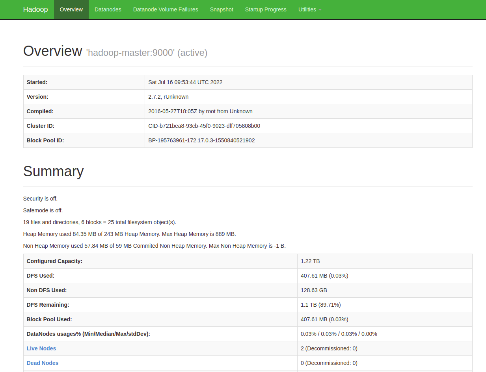
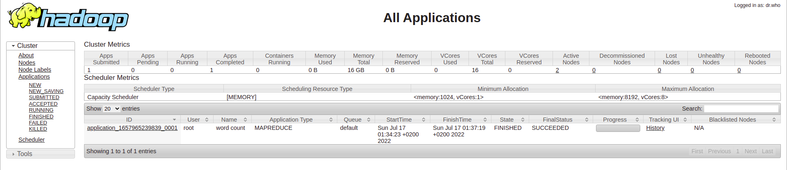
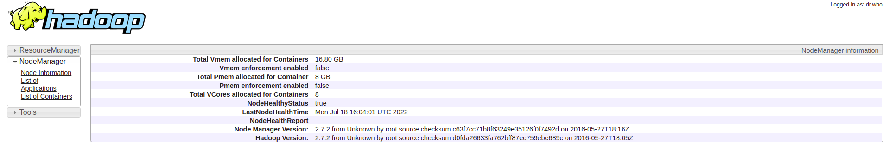

# TP1 - Le traitement Batch avec Hadoop HDFS et Map Reduce

`Objectif : `Initiation au framework hadoop et au patron MapReduce, utilisation de docker
pour lancer un cluster hadoop de 3 noeuds.

installation de hadoop avec docker 
----------------------
verifier si docker est bien installé et activé 
```
$ sudo systemctl status docker
```

Télécharger l'image docker uploadée sur dockerhub:
------------
syntaxe : `docker pull [userDockerHub/NomFichier]:[#tag]`
```
$ sudo docker pull liliasfaxi/spark-hadoop:hv-2.7.2
```

voir si l'image hadoop a été téléchargée
---------------------
syntaxe : `docker images`

```
$ sudo docker images 
```

créer un réseau qui porte le nom hadoop qui fomera le cluster 
---------------------

syntaxe : `docker network create --drive=bridge [Nom_Reseau]`

```
$ sudo docker network create --drive=bridge hadoop
```

créer le container à partir de l'image hadoop coorespondant au name node (master)
---------------

nom container  =  hadoop-master 
image source  =  liliasfaxi/spark-hadoop:hv-2.7.2

//container hadoop-master port 50070, 8088, 16010

`$ sudo docker run -itd --net=hadoop -p 50070:50070 -p 8088:8088 -p 7077:7077 -p 16010:16010 --name hadoop-master  --hostname hadoop-master liliasfaxi/spark-hadoop:hv-2.7.2 `


* Hadoop overiew (hadoop-master):  http://localhost:50070/ (qui permet d'a cher les informations du resource manager de
Yarn et visualiser le comportement des différents jobs. )

* Hadoop cluster :  http://localhost:8088/ ( visualiser l'avancement et les résultats de vos Jobs
(Map Reduce ou autre) )



commande docker pour verifier un container qui tourner 
------------------------------------------

```
$ sudo docker ps
```
//tous les container y compris ceux qui sont stopé 

`$ sudo docker ps -a `

// supprime le container

`$ sudo docker rm [ID_container]  `

créer le container à partir de l'image hadoop coorespondant deux autres node (slave)
---------------

```
$  sudo docker run -itd --net=hadoop -p 8040:8042 --name hadoop-slave1  --hostname hadoop-slave1 liliasfaxi/spark-hadoop:hv-2.7.2 

$  sudo docker run -itd --net=hadoop -p 8041:8042 --name hadoop-slave2  --hostname hadoop-slave2 liliasfaxi/spark-hadoop:hv-2.7.2 
```
* hadoop-slave1 avec port 8040 :  http://localhost:8040/
* hadoop-slave2 avec port 8041 :  http://localhost:8041/

 Entrer dans le contenaire master pour commencer à l'utiliser.
--------------------------------------------------------
Faire en sorte que toutes les requetes soient exécutées sur le container hadoop-master 

```
$ sudo docker exec -it hadoop-master bash
```