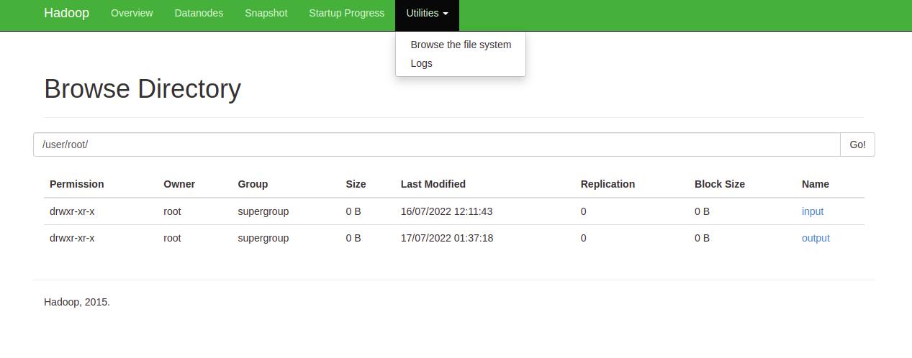
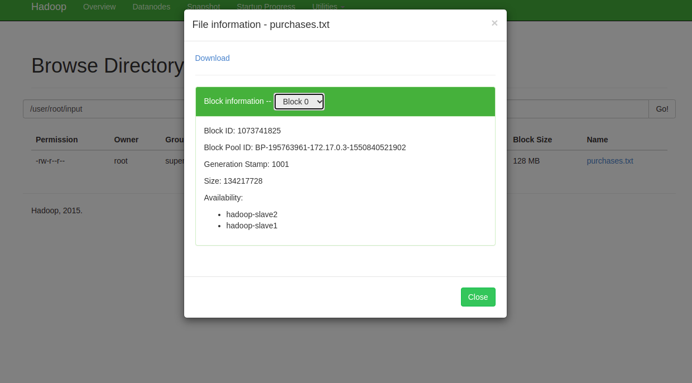

HDFS
---------

Exécuter les jobs sur le container master 
```
$ sudo docker exec -it hadoop-master bash
```
résultat est le suivant :   `root@hadoop-master:~#`

voir la liste des fichiers contenus dans le containers 

```
hadoop-master:~# ls
hdfs  purchases.txt  purchases2.txt  run-wordcount.sh  start-hadoop.sh  start-kafka-zookeeper.sh
```

voir la taille du fichier 
```
@hadoop-master:~# ls -l purchases.txt  purchases.txt
-rw-r--r-- 1 root root 211312924 Feb  8  2017 purchases.txt
```

lancer hadoop et yarn.
--------------------

Démarrer le namenode [hadoop-master] et yarn daemon pour gestiont des datanode  [slave1 & slave2] (allocation des ressources dans les nodes manager )

```
hadoop-master:~# ./start-hadoop.sh 
```


Créer un répertoire dans HDFS, appelé input 
------------------------------------------
```
hadoop-master:~# hadoop fs -mkdir -p input 
```
`hadoop fs `: permet d'avoir accès au contenu du repertoir racine hdfs 

`-mkdir` : permet de créer un dossier dans hdfs 

` -p` : permet de construire le path depuis le dossier parent 


Tester si le repertoire input est créer 
--------------------------------------
Afficher les fichiers contenu dans le repertoire racine 

```
hadoop-master:~# hadoop fs -ls 
```

resultat : 
```
drwxr-xr-x   - root supergroup          0 2022-07-16 10:01 input
```
ou dans  le browser  utilise > browse the file systeme 

chercher : user/root/


copier le fichier purchases.txt qui se trouve dans hadooop dans le repertoire input 
------------------------------------------------------------------------------------

syntaxe : `hadooop fs -put [FICHIER_à_COPIER] [Repertoire_Destinataire]`

```
hadoop-master:~# hadoop fs -put purchases.txt input 
```

Lors de la copîe hadoop découpe le fichier en un ensemble de blocks  reparties sur l'ensemble des noeuds du système (datanodes)

tester si le fichier a bien été copié
-------------------------------------
Affiche les fichiers contenus dans le repertoire input 
syntaxe : hadooop fs -ls [Repertoire_Parent]

```
root@hadoop-master:~# hadoop fs -ls input 
Found 1 items
-rw-r--r--   2 root supergroup  211312924 2022-07-16 10:11 input/purchases.txt
```


Affiche le fcontenu du fichier 
----
syntaxe : `hadooop fs -tail  [path/fichier]`

```
hadoop-master:~#   hadoop fs -tail input/purchases.txt
```

visualiser hadoop web
------------------

url :  http://localhost:50070/

dans utilitises / browser file systems

Browse Directory

/user/root/input : 

```
Permission	Owner	Group	    Size	    Last Modified	      Replication	Block Size    Name
-rw-r--r--	root	supergroup	201.52 MB	16/07/2022 12:11:43	  2	            128 MB	      purchases.txt
```


les commandes les plus utilisées pour manipuler les chiers dans HDFS:

