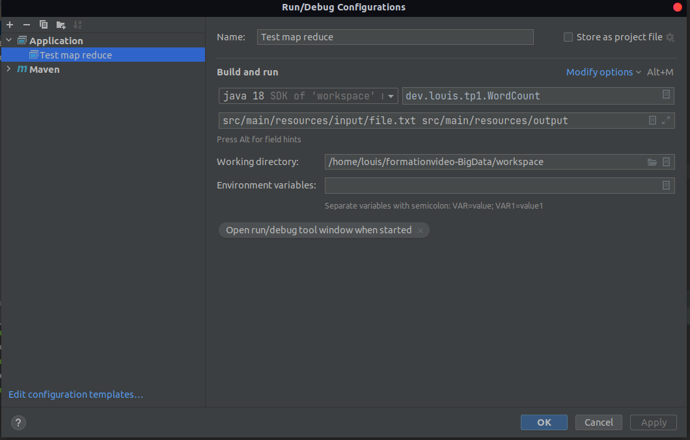
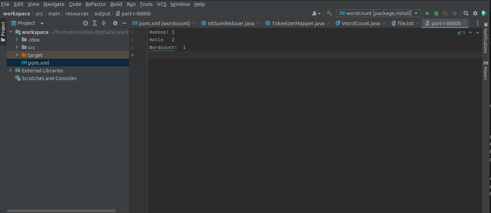
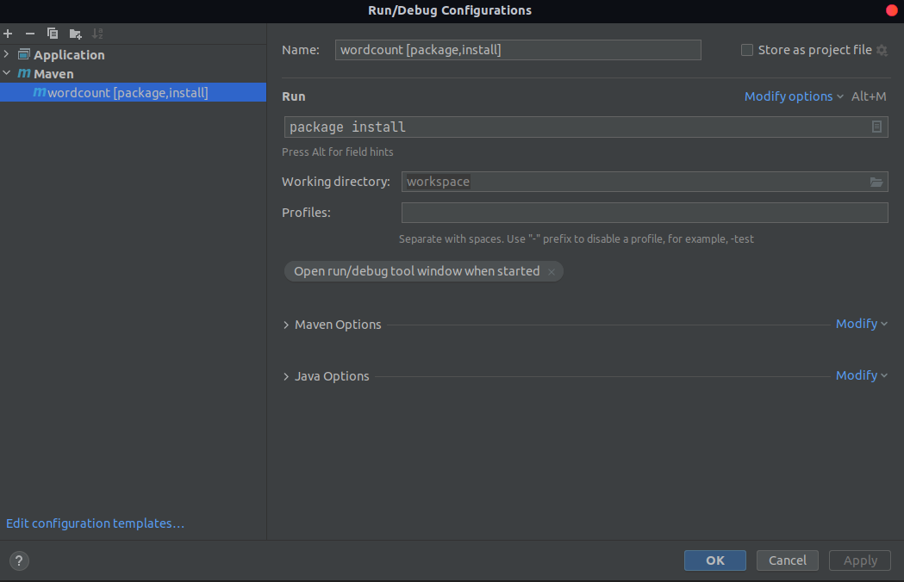
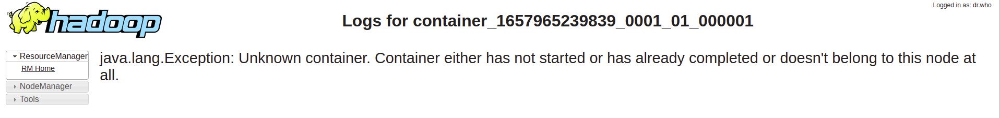

Map Reduce 
-----------
Vous pouvez également visualiser l'avancement et les résultats de vos Jobs (Map Reduce ou autre) en allant à l'adresse: 
http://localhost:8088

processus map reduce :
---
1 - map (collecte et preparation des données clé /valeur )

2 - shuffle ( regrouper les données dans une machine )

3 - sort ( trier  les données selon clé / valeur )

4 - reduce  ( traitement des données )

création d'un wordcount map reduce 
----------------------------------

Mappers : pemet d'extraire un ensemble de données sous forme de clé/valeur

Reducers : permet d'effectuer un traitement sur un ensemble de données triées selon leur clé / valeur

projet maeven
-------------
* Intelij

* open jdk 18

* group id : hadooop.mapreduce

* artefact : wordcount

* version : 1 

Copier et coller les dépendances hadoop dans ``pom.xml``
```
  <dependencies>
    <dependency>
      <groupId>org.apache.hadoop</groupId>
      <artifactId>hadoop-common</artifactId>
      <version>2.7.2</version>
    </dependency>
    <!-- https://mvnrepository.com/artifact/org.apache.hadoop/hadoop-mapreduce-client-core -->
    <dependency>
      <groupId>org.apache.hadoop</groupId>
      <artifactId>hadoop-mapreduce-client-core</artifactId>
      <version>2.7.2</version>
    </dependency>
    <!-- https://mvnrepository.com/artifact/org.apache.hadoop/hadoop-hdfs -->
    <dependency>
      <groupId>org.apache.hadoop</groupId>
      <artifactId>hadoop-hdfs</artifactId>
      <version>2.7.2</version>
    </dependency>
    <dependency>
      <groupId>org.apache.hadoop</groupId>
      <artifactId>hadoop-mapreduce-client-common</artifactId>
      <version>2.7.2</version>
    </dependency>
  </dependencies>
```
créer le package `dev.louis.tp1`

Créer la classe TokenizerMapper, contenant ce code:
-----------------------------------------------------

```
package dev.louis.tp1;

import org.apache.hadoop.io.IntWritable;
import org.apache.hadoop.io.Text;
import org.apache.hadoop.mapreduce.Mapper;

import java.io.IOException;
import java.util.StringTokenizer;

public class TokenizerMapper extends Mapper<Object, Text, Text, IntWritable>{

    private final static IntWritable one = new IntWritable(1);
    private Text word = new Text();

    public void map(Object key, Text value, Mapper.Context context) throws IOException, InterruptedException {
        StringTokenizer itr = new StringTokenizer(value.toString());
        while (itr.hasMoreTokens()) {
            word.set(itr.nextToken());
            context.write(word, one);
        }
    }
}
```


Créer la classe IntSumReducer:
--------------------------------------------------
```
package dev.louis.tp1;

import org.apache.hadoop.io.IntWritable;
import org.apache.hadoop.io.Text;
import org.apache.hadoop.mapreduce.Reducer;

import java.io.IOException;

public class IntSumReducer extends Reducer<Text,IntWritable,Text,IntWritable> {

    private IntWritable result = new IntWritable();

    public void reduce(Text key, Iterable<IntWritable> values, Context context) throws IOException, InterruptedException {
        int sum = 0;
        for (IntWritable val : values) {
            System.out.println("value: "+val.get());
            sum += val.get();
        }
        System.out.println("--> Sum = "+sum);
        result.set(sum);
        context.write(key, result);
    }
}
```
 créer la classe WordCount:
----------------------------
__________________________________________________

pour initialiser le map reduce 
specifier le mapper , reducer et le combiner 
__________________________________________________
```
package dev.louis.tp1;

import org.apache.hadoop.conf.Configuration;
import org.apache.hadoop.fs.Path;
import org.apache.hadoop.io.IntWritable;
import org.apache.hadoop.io.Text;
import org.apache.hadoop.mapreduce.Job;
import org.apache.hadoop.mapreduce.lib.input.FileInputFormat;
import org.apache.hadoop.mapreduce.lib.output.FileOutputFormat;

public class WordCount {
    public static void main(String[] args) throws Exception {
        Configuration conf = new Configuration();
        Job job = Job.getInstance(conf, "word count");
        job.setJarByClass(WordCount.class);
        job.setMapperClass(TokenizerMapper.class);
        job.setCombinerClass(IntSumReducer.class);
        job.setReducerClass(IntSumReducer.class);
        job.setOutputKeyClass(Text.class);
        job.setOutputValueClass(IntWritable.class);
        FileInputFormat.addInputPath(job, new Path(args[0]));
        FileOutputFormat.setOutputPath(job, new Path(args[1]));
        System.exit(job.waitForCompletion(true) ? 0 : 1);
    }
}
```

TESTER MAP REDUCE EN LOCAL 
----------------------------------
Dans votre projet sur IntelliJ:

Créer un répertoire input sous le répertoire resources de votre projet.
Créer un fichier de test: file.txt dans lequel vous insèrerez les deux lignes:

  Hello Wordcount!
  Hello Hadoop!

Créer une configuration de type Application (Run->Edit Configurations...->+->Application).
Définir comme Main Class: tn.insat.tp1.WordCount, et comme Program Arguments: src/main/resources/input/file.txt src/main/resources/output
Lancer le programme. Un répertoire output sera créé dans le répertoire resources, contenant notamment un fichier part-r-00000, dont le contenu devrait être le suivant:



Lancer Map Reduce sur le cluster
Dans votre projet IntelliJ:

Créer une configuration Maven avec la ligne de commande: package install
Lancer la configuration. Un fichier wordcount-1.jar sera créé dans le répertoire target du projet.
Copier le fichier jar créé dans le contenaire master. Pour cela:
Ouvrir le terminal sur le répertoire du projet. Cela peut être fait avec IntelliJ en ouvrant la vue Terminal située en bas à gauche de la fenêtre principale.

copier le fichier jar dans hadooop 
----------------------------------
copier le fichier jar dans map reduce 
```
workspace$ sudo docker cp target/wordcount-1.jar hadoop-master:/root/wordcount-1.jar
```
exécuter le fichier jar 
-----------------------
exécuter l'application  wordcount dans le dossier input en entré et output en sorti
```
hadoop-master:~# hadoop jar wordcount-1.jar dev.louis.tp1.WordCount input output
```
http://localhost:8041/ // l'acces au noeud 1
* l'acces au noeud 2 : http://localhost:8041/ 

* log container slave 1
http://localhost:8041/node/containerlogs/container_1657965239839_0001_01_000001/root 


```
adoop-master:~# hadoop fs -ls 
Found 2 items
drwxr-xr-x   - root supergroup          0 2022-07-16 10:11 input
drwxr-xr-x   - root supergroup          0 2022-07-16 23:37 output

```
verifier si le dossier output a été crée
```
adoop-master:~# hadoop fs -ls  output
Found 2 items
-rw-r--r--   2 root supergroup          0 2022-07-16 23:37 output/_SUCCESS
-rw-r--r--   2 root supergroup     499048 2022-07-16 23:37 output/part-r-00000

hadoop-master:~# hadoop fs -get output/part-r-00000

hadoop-master:~# ls
hdfs  part-r-00000  purchases.txt  purchases2.txt  run-wordcount.sh  start-hadoop.sh  start-kafka-zookeeper.sh  wordcount-1.jar
```
voir le contenu du fichier part-r-00000 
```
hadoop-master:~# tail -20 part-r-00000 
Stockton	39996
Supplies	229222
Tampa	40136
Toledo	40139
Toys	229964
Tucson	39870
Tulsa	40247
Vegas	80178
Video	230237
Virginia	40169
Visa	827221
Vista	40080
Washington	40503
Wayne	40439
Wichita	40422
Winston–Salem	40208
Women's	230050
Worth	40336
York	40364
and	229667
```