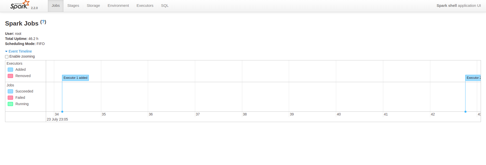

Objectifs du TP2
Utilisation de Spark pour réaliser des traitements par lot et des traitements en streaming.

# Exmple 

## étape 1 :  création d'un RDD depuis un donnée extern  
créer un fichier depuis hadoop file text 
RDD [String] : docs
```
val docs = spark.textFile("/docs/")

```
## étape 2 :  Opération map
convertir chaque ligne en upper case
```
val lower = docs.map(line => line.ToLowerCase)

ou

val lower = docs.map(_.ToLowerCase)
```
## étape 3 :  Opération map et flatMap

split line into words 
```
val words = lower.flatMap(line => line.split("\\+s"))

```
## étape 4 :  Pair de clé valeur 

split line into words 
```
val count = words.map(word => (word, 1))

```
## étape 5 :  Shuffle

compter tous les mots 
```
val freq = count.reduceBykey(_+_)

```


# installer spark shell 

voir les machines dans mon docker local 

* docker ps  : si elles sont démarrées
* docker ps -a : si elles sont pas démarrées
* docker start [ID_Container]: demarrer un machine virtuelle à partir de l'id
* docker exec -it [Container] [Operation] :  se loger en ssh sur le container master 

démmarage de notre cluster :
```
sudo docker start hadoop-master hadoop-slave1 hadoop-slave2
```
se loger en ssh sur hadoo master 
```
sudo docker exec -it hadoop-master bash 
```
lancer daemon yarn 

```
hadoop-master:~# ./start-hadoop.sh

```
voir la liste des processus java 
```
hadoop-master:~# jps
164 NameNode
374 SecondaryNameNode
822 Jps
555 ResourceManager
```

créer un fichier file.txt
```
hadoop-master:~# touch file.txt
```

ecrire du text dans le fichier
```
root@hadoop-master:~# echo "Hello Spark Wordcount !" > file.txt               
root@hadoop-master:~# echo "Hello Hadoop !" >> file.txt 
root@hadoop-master:~# cat file.txt 
Hello Spark Wordcount !
Hello Hadoop !
```

charger le fichier sur hdfs
```
root@hadoop-master:~# hadoop fs -put file.txt 


root@hadoop-master:~# hadoop fs -ls   
Found 3 items
-rw-r--r--   2 root supergroup         39 2022-07-23 23:01 file.txt
drwxr-xr-x   - root supergroup          0 2022-07-16 10:11 input
drwxr-xr-x   - root supergroup          0 2022-07-16 23:37 output
```

lancer spark shell
```
root@hadoop-master:~# spark-shell
```
résultat
```
global_temp, returning NoSuchObjectException
Spark context Web UI available at http://172.18 .0.2:4040
Spark context available as 'sc' (master = yarn, app id = application_1658616378380_0001).
Spark session available as 'spark'.
Welcome to
      ____              __
     / __/__  ___ _____/ /__
    _\ \/ _ \/ _ `/ __/  '_/
   /___/ .__/\_,_/_/ /_/\_\   version 2.2.0
      /_/
         
Using Scala version 2.11.8 (OpenJDK 64-Bit Server VM, Java 1.8.0_191)
Type in expressions to have them evaluated.
Type :help for more information.

scala>

```
Spark shell application UI url : http://172.18.0.2:4040 ou http://localhost:8088/proxy/application_1658616378380_0001/



# langage scala 

## Opérations

créer un fichier depuis hadoop file text 
```
scala> val lines = sc.textFile("file.txt")
```
résultat 
```
lines: org.apache.spark.rdd.RDD[String] = file.txt MapPartitionsRDD[1] at textFile at <console>:24
```

split line into words
```
scala> val words = lines.flatMap(_.split("\\s+"))
```
résultat
```
words: org.apache.spark.rdd.RDD[String] = MapPartitionsRDD[2] at flatMap at <console>:26
```
Pair de clé valeur  et reduce le tout selon la clé 
```
scala> val wc = words.map(w=>(w, 1)).reduceByKey(_+_)
```
résultat
```
wc: org.apache.spark.rdd.RDD[(String, Int)] = ShuffledRDD[4] at reduceByKey at <console>:28
```

## Action

Le RDD final va être sauvegarder sous forme de text dans hdfs 
```
scala> wc.saveAsTextFile("file.count")
```

lire le contenu du fichier
ctl + C  pour sortir de scala 

voir le contenu du dossier file.count
```
root@hadoop-master:~# hadoop fs -ls file.count
Found 3 items
-rw-r--r--   2 root supergroup          0 2022-07-25 22:15 file.count/_SUCCESS
-rw-r--r--   2 root supergroup         10 2022-07-25 22:15 file.count/part-00000
-rw-r--r--   2 root supergroup         41 2022-07-25 22:15 file.count/part-00001

```
voir le contenu de la réponse file.count/part-00000
```
root@hadoop-master:~# hadoop fs -tail file.count/part-00000
(Hello,2)
```
voir le contenu de la réponse file.count/part-00001
```
root@hadoop-master:~# hadoop fs -tail file.count/part-00001
(Spark,1)
(!,2)
(Wordcount,1)
(Hadoop,1)
```

# Wordcount spark avec java 